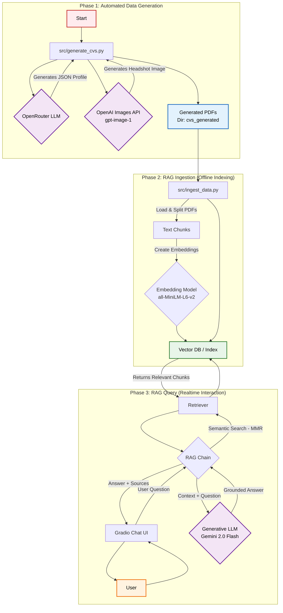

# AI-Powered CV Screener
This project is an end-to-end prototype of an AI-powered tool for screening CVs. It features a chat application that allows a user to ask questions about a collection of résumés and receive answers grounded in the documents' content.

## Project presentation videos

[First Part](/videos/First.mp4)

[Second Part](/videos/Second.mp4)

## Features
- Automated Synthetic Data Generation: Creates a dataset of 25 realistic PDF CVs, complete with structured text and AI-generated headshots, using a fully automated script.   

- Retrieval-Augmented Generation (RAG) Backend: Implements a robust RAG pipeline to process, index, and query the content of the CVs efficiently.   

- Interactive Chat Interface: A clean and simple web UI where users can ask questions in natural language.   

- Grounded & Sourced Answers: The AI's responses are based only on the information within the CVs. The application also indicates which specific CVs were used as sources for each answer, fulfilling all core and optional requirements.   

- Optimized Retrieval: Utilizes advanced retrieval strategies like Maximal Marginal Relevance (MMR) to ensure answers are accurate and source lists are precise.

## Architecture & Workflow
The application is designed in three distinct phases, moving from data creation to a fully interactive user experience.



### Phase 1: Automated Data Generation

- A Python script uses a Large Language Model (LLM) via OpenRouter to generate 25 unique candidate profiles in a structured JSON format.

- For each profile, the Google Gemini API is called to generate a realistic, matching headshot.

- The script then uses the fpdf2 library to programmatically assemble the JSON data and images into professionally formatted PDF CVs.

### Phase 2: RAG Ingestion (Offline Indexing)

- The generated PDF CVs are loaded and their text is extracted.

- Using LangChain, the text is split into smaller, overlapping chunks for effective processing.

- The local sentence-transformers/all-MiniLM-L6-v2 model converts these chunks into semantic vector embeddings.

- These embeddings are stored and indexed in a local ChromaDB vector store, creating a searchable knowledge base.

### Phase 3: RAG Query (Real-time Chat)

- The user asks a question through the Gradio web interface.

- The LangChain RAG pipeline retrieves the most relevant and diverse document chunks from ChromaDB using the Maximal Marginal Relevance (MMR) search strategy.

- The user's question and the retrieved context are sent to a generative LLM (google/gemini-2.0-flash-exp:free) via OpenRouter.

- The LLM generates a response grounded in the provided context, which is then displayed in the chat UI along with the names of the source CVs.

## Tech Stack & Rationale
Each component of the tech stack was chosen to prioritize rapid development, performance, and adherence to the project's requirements, demonstrating strong AI literacy and a pragmatic approach to problem-solving.   

| **Component**           | **Technology**                | **Rationale**                                                                                                                                                                                                                                        |
|-------------------------|-------------------------------|------------------------------------------------------------------------------------------------------------------------------------------------------------------------------------------------------------------------------------------------------|
| Development Environment | Docker & Docker Compose       | Ensures a consistent, reproducible environment, simplifying dependency management and setup for any user.                                                                                                                                            |
| Orchestration           | LangChain                     | The industry standard for building RAG applications. Its modular components (loaders, splitters, chains) significantly accelerated development.                                                                                                   |
| CV Text Generation      | OpenRouter (Mistral 7B)       | Provided a free, flexible API to generate high-quality, structured JSON data for the CVs.                                                                                                                                                         |
| CV Image Generation     | OpenAI Images API              | Allowed for the fully automated generation of realistic headshots, removing a manual step and making the data pipeline seamless.                                                                                                                     |
| PDF Assembly            | fpdf2                         | A lightweight, pure-Python library that offers fine-grained control for programmatically creating professional PDF layouts from the generated data.                                                                                               |
| Embedding Model         | `all-MiniLM-L6-v2`            | An excellent open-source model that runs locally on a CPU. It offers a great balance of speed and performance, perfect for a fast and responsive prototype without external API dependencies.                                                        |
| Vector Database         | ChromaDB                      | An open-source, local-first vector store that is incredibly easy to set up and integrates seamlessly with LangChain. Ideal for rapid prototyping without the overhead of a managed cloud service.                                                 |
| Generative LLM          | OpenRouter (Gemini 2.0 Flash) | OpenRouter provides access to a wide variety of models. The Gemini Flash model was selected for its massive 1M+ token context window and superior instruction-following capabilities, which are critical for high-quality RAG performance.           |
| Frontend UI             | Gradio                        | The fastest and most efficient choice for building a simple chat interface. Its `gr.ChatInterface` component provides a complete UI out of the box, which is significantly faster than building it manually with alternatives like Streamlit. |

 

## Setup and Installation
### Prerequisites
- Docker
- Docker Compose

### Instructions
#### Clone the Repository
```bash
git clone https://github.com/your-username/cv-screener-project.git
cd cv-screener-project
```

#### Create Environment File

Create a file named .env in the root of the project and add your API keys.

#### Build the Docker Image
This command builds the Docker image, installing all necessary Python dependencies from requirements.txt.

```bash
make build
```

## How to Run the Application
Follow these steps in order from the project's root directory.

### Generate the Synthetic CVs
This script will call the LLM and image generation APIs to create 25 PDF CVs and save them in the /cvs_generated directory.

```bash
make generate_cvs
```

### Ingest the Data into the Vector Store
This script processes the PDFs and creates a local vector database in the /vector_store directory. This only needs to be run once.

```bash
make ingest
```

### Launch the Web Application
This command starts the Gradio web server.

```bash
make up
```

### Access the UI
Open your web browser and navigate to http://localhost:7860. You can now start asking questions about the CVs!

## Key Design Decisions
- Fully Automated Data Pipeline: The initial plan involved manually downloading AI-generated images. This was improved by integrating the Gemini API, making the entire data generation process a single, automated script. This enhances reproducibility and efficiency.

- Local-First RAG Components: The choice of a local embedding model (all-MiniLM-L6-v2) and a local vector store (ChromaDB) was a deliberate decision to ensure the application could run entirely offline, as per the requirements, while also maximizing speed and minimizing setup complexity.   

- Advanced Retriever Tuning: Initial testing revealed that a basic semantic search retriever struggled with specific queries (e.g., "Summarize the profile of [Name]"). The retriever was tuned by:

- Increasing the number of retrieved documents (k=5) to improve recall.

- Switching to the Maximal Marginal Relevance (MMR) search type to improve precision, ensuring that the sources listed are both relevant and diverse. This results in more accurate answers and cleaner source attribution.

- Optimized Developer Experience: The application is containerized with Docker and uses Gradio's hot-reloading feature. This means that any changes to the source code are reflected instantly without needing to manually rebuild the image, making development and iteration much faster.